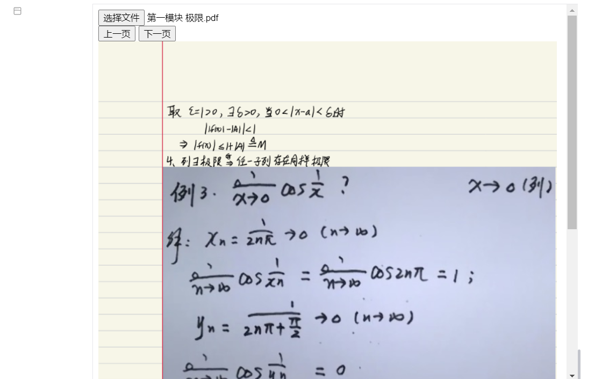

# docs-all-in-one

# Siyuan Notes Document Aggregation Pendant

(I really don't want to switch screens to see other documents anymore)

## Used to display doc documents, PDF files, Excel spreadsheets in Siyuan Notes
**As shown in the figure:**

### Doc:

​​

**PDF:**

​

### Excel spreadsheets that are eagerly anticipated but have a lot of bugs:

​

Known bug: only columns with non empty header will be displayed

### Regarding different options:

​

* Permanent snapshot: This block will be permanently saved as a snapshot, which is the last appearance before your first departure. It will remain unchanged and can be viewed across endpoints
* Temporary: The next time you open it, you will be redirected to the homepage and the last document you opened will not be saved
* Support for editing: No matter which mode you are in, the first time you open an Excel file, you can directly edit the table
* Manage snapshots: You can view or delete document snapshots that have already been generated
